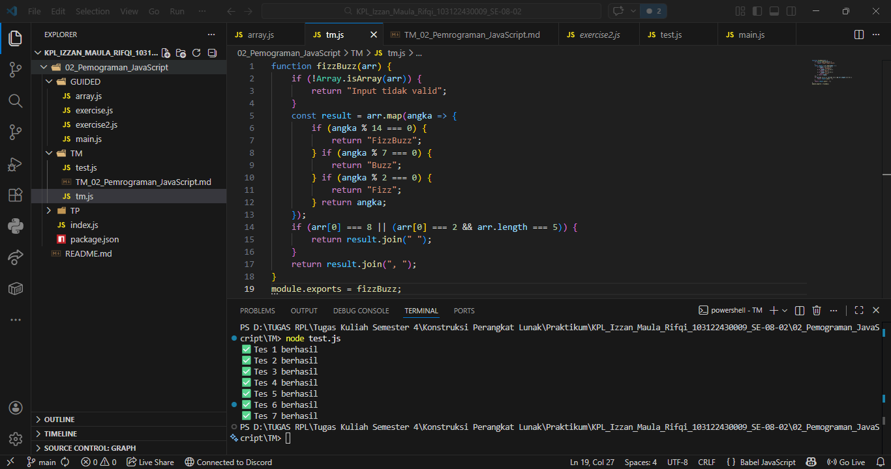

TUGAS Mandiri 02: Pemrograman JavaScript

Soal:
Buatlah sebuah fungsi bernama fizzBuzz yang menerima input larik (array) dan mengembalikan deretan bilangan dan "Fizz" untuk kelipatan 2, "Buzz" untuk kelipatan 7, dan "FizzBuzz" untuk kelipatan 14. Beri nama berkas program sebagai tm.js dan taruh di direktori TM.

kode sumber:
[Hasil Kode](tm.js)

contoh:
Input:
[8, 9, 32, 75, 84]
Output:
Fizz 9 Fizz 75 FizzBuzz

Output:

Deskripsi Program:
Ini adalah program bernama "FizzBuzz" yang Fungsi utamanya adalah menerima sekumpulan angka dalam bentuk baris/larik lalu memproses setiap angka didalamnya secara berurutan untuk menghasilkan deretan teks atau angka baru sesuai dengan aturan matematika tertentu. Program akan memeriksa apakah ini berupa array atau bukan, jika benar berupa array, maka program akan mengecek, jika angka itu habis dibagi 14 maka diubah menjadi "FizzBuzz", jika angka itu habis dibagi 7 maka diubah menjadi "Buzz", jika angka itu habis dibagi 2 maka diubah menjadi "Fizz", jika angka itu tidak memenuhi syarat dibagi 14, 7, dan 2. Maka angka tersebut tidak akan diubah. Setelah diubah, program akan menyatukannya menjadi satu baris atau String.