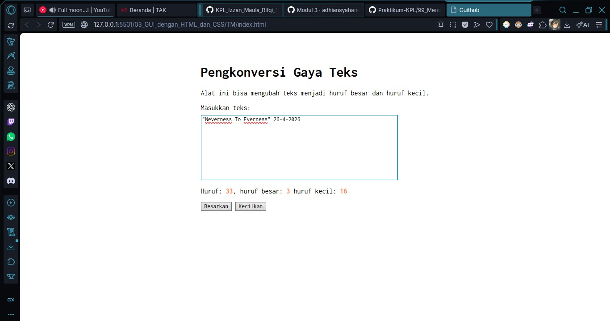

# Tugas Mandiri 03: GUI dengan HTML dan CSS

**Nama:** Izzan Maula Rifqi <br>
**NIM:** 103122430009 <br>
**Kelas:** SE-08-02 <br>
**Dosen Pengampu:** Yudha Islami Sulistiya <br>
**Asisten Praktikum:** Adhiansyah Muhammad Pradana Farawowan, Hamid Khaeruman <br>

## Soal
Setelah kamu menyelesaikan tugas pendahuluan (bisa buka di atas), terapkanlah fungsi untuk (1) menghitung huruf kecil yang disediakan di #hk, (2) mengubah huruf kecil ke huruf besar ketika pengguna menekan tombol #huruf-besar, dan (3) mengubah huruf besar ke huruf kecil ketika pengguna menekan tombol #huruf-kecil. <br>

Untuk nomor 2 dan 3, tampilkan hasilnya di dalam editor-kecil. <br>
Kemudian, hapuslah fitur "Paragrafkan" dari alat. <br>
Contoh uji kasus untuk hitung huruf kecil:
```
reverse one nine nine nine -> 22

reverse 1999 -> 7

Konstruksi KPL -> 9

You're already coding statecharts, they’re just implied. -> 46

eglassick@sanmiguelschools.org -> 28 
```
Contoh uji kasus untuk "Besarkan" huruf:
```
Deskripsi program Pada function mulOfArray -> DESKRIPSI PROGRAM PADA FUNCTION MULOFARRAY

THE DEVIL WEARS PRADA 2 -> THE DEVIL WEARS PRADA 2

Write, test, and fix code quickly with GitHub Copilot -> WRITE, TEST, AND FIX CODE QUICKLY WITH GITHUB COPILOT
```
Contoh uji kasus untuk "Kecilkan" huruf:
```
Deskripsi program Pada function mulOfArray -> deskripsi program pada function mulofarray

THE DEVIL WEARS PRADA 2 -> the devil wears prada 2

Write, test, and fix code quickly with GitHub Copilot -> write, test, and fix code quickly with github copilot
```
## Program/Kode
Tersedia di [index.html](index.html), [index.css](index.css), dan [index.js](index.js)

## Output


## Deskripsi
Program ini adalah tempat pengkonversi gaya teks, di mana pengguna bisa memasukkan kalimat ke dalam kotak teks yang disediakan, lalu sistem akan secara otomatis mendeteksi dan menghitung jumlah total huruf beserta rincian huruf kecilnya. program ini menggunakan HTML sebagai tampilan untuk lamannya dan CSS untuk memperindah tampilan atau style dari lamannya. <br>
Supaya lebih interaktif, laman ini juga menggunakan JavaScript yang dapat: <br>
1. Menghitung huruf secara real-time: ada pendeteksi kejadian berjenis `"input"` pada `<textarea id="editor-kecil">`. Jadi Setiap kali mengetik sesuatu, program akan membaca teks tersebut, lalu untuk mencari huruf secara spesifik, disini menggunakan Regular Expression pada `text.match(/[a-z]/g)`, kode ini hanya akan mengumpulkan semua huruf a hingga z dan tidak termasuk angka maupun elemen, lalu akan dihitung jumlahnya menggunakan `.length` dan menampilkannya pada elemen `<span id="hk">` untuk menghitung huruf kecil. Selain fungsi ini juga bisa menghitung angka besar maupun kecil dengan `<span id="hf">0</span>` dan huruf besar menggunakan `<span id="hb">0</span>`<br>
2. Mengubah ke huruf besar: saat mengklik tombol `<button id="huruf-besar">`, program akan mengambil teks dari `textarea`, lalu mengubah semuanya menjadi kapital menggunakan fungsi `editorElement.value.toUpperCase()`. <br>
3. Mengubah ke huruf kecil: saat mengklik tombol `<button id="huruf-kecil">`, program akan mengambil teks dari `textarea`, lalu mengubah semuanya menjadi huruf keci menggunakan fungsi `editorElement.value.toLowerCase()`. <br>