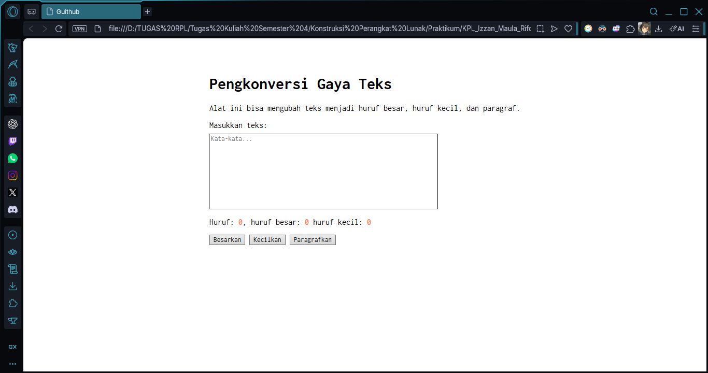

# Tugas Pendahuluan 03: GUI dengan HTML dan CSS

**Nama:** Izzan Maula Rifqi  
**NIM:** 103122430009  
**Kelas:** SE-08-02  
**Dosen Pengampu:** Yudha Islami Sulistiya  
**Asisten Praktikum:** Adhiansyah Muhammad Pradana Farawowan, Hamid Khaeruman  

## Soal
Buatlah tata letak laman yang kamu buat berada di tengah seperti di bawah ini, dan juga ubah font-nya dengan Inconsolata dari [Google Fonts](https://fonts.google.com).

## Program/Kode
Tersedia di [HTML](index.html)
, [CSS](index.css)
dan [JavaScript](index.js)

## Output

## Deskripsi Program
Program ini adalah sebuah alat pengkonversi gaya teks interaktif berbasis web, dimana pengguna bisa memasukkan kalimat ke dalam kotak teks yang disediakan, lalu sistem akan secara otomatis mendeteksi dan menghitung jumlah total huruf beserta rincian huruf besar dan kecilnya.     
Setelah itu laman akan dibuat berada di tengah dan mengubah font-nya dengan Inconsolata dari Google Fonts. Cara meneraptkan font Inconsolata yaitu pada `index.html` menambahkan `<link>` font Inconsolata dari Google fonts di dalam bagian `<head>`, Setelah itu pada `index.css`, Menambahkan universal selector (`*`) dengan properti `font-family: 'Inconsolata', monospace;`, Ini berfungsi untuk memaksa semua elemen berubah fontnya ke Inconsolata.
Untuk menengahkan layout halaman, pada `index.html` membungkus seluruh elemen pada `<body>` ke dalam sebuah `
` baru yang diberi class `<container>`. Lalu di `index.css`, Menggunakan Flexbox pada `body` dengan properti `display: flex;` dan `justify-content: center;` Supaya elemen-elemen di dalamnya (container) tepat ke tengah layar secara horizontal.