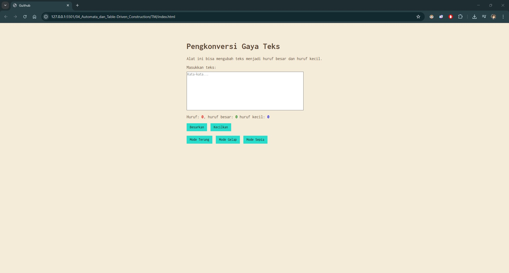

# Tugas Mandiri 04: Automata dan Table Driven Construction

**Nama:** Izzan Maula Rifqi  
**NIM:** 103122430009  
**Kelas:** SE-08-02  
**Dosen Pengampu:** Yudha Islami Sulistiya  
**Asisten Praktikum:** Adhiansyah Muhammad Pradana Farawowan, Hamid Khaeruman  

## Soal
Tambahkan mode sepia dengan ketentuan:
| Elemen         | Warna   |
|----------------|---------|
| Latar belakang | #F4ECD8 
| Warna teks     | #5B4636 |    

Biarkan form tetap warna putih.

Contoh tampilan

Ketentuan lainnya:
 1. Bagian mode-div harus menaungi tiga button: `light`, `dark`, dan `sepia`  
 2. Bisa berpindah state secara mulus: `sepia` menghasilkan `sepia-mode`, `dark` menghasilkan `dark-mode`, dan `light` menghasilkan `light-mode`

## Program/Kode
Tersedia di [index.html](index.html), [index.css](index.css), dan [index.js](index.js)

## Output

## Deskripsi
Program Konversi gaya teks yang bisa menghitung huruf, huruf kecil, serta huruf besar dan fitur besarkan dan kecilkan huruf. Selain sudah ada fitur mode Terang dan Mode Gelap, program ini juga tersedia mode Sepia. 
Pada HTML, tombol Sepia dibuat di `<button id="sepia">Mode Sepia</button>`, yang diletakkan di dalam kelompok `
`. Supaya visualnya terlihat seperti Sepia, Pada CSS dibuat class bernama `.sepia-mode`. Ketika status ini aktif, warna latar belakang keseluruhan halaman akan diubah menjadi krem (`background-color: #F4ECD8;`) dengan warna teks cokelat gelap (`color: #5B4636;`). Meskipun halaman berubah warna, area kotak input (`.sepia-mode .kotak-input`) dibuat tetap memiliki latar belakang putih dengan teks hitam agar tulisan pengguna tetap kontras dan mudah dibaca. Sementara itu, tombol-tombol kontrol diubah warna latarnya menjadi teal (`background-color: #29ddcc;`) dengan teks berwarna hitam. 
Supaya Program ini berjalan lebih interaktif pada web, pada JavaScript program akan menangkap tombol sepia menggunakan perintah `document.getElementById("sepia")` dan memantau interaksi pengguna terhadap tombol sepia menggunakan `addEventListener`. Ketika tombol diklik, sistem akan melakukan perpindahan state secara mulus dengan cara menimpa seluruh class yang ada pada elemen utama `<body>` menggunakan perintah `document.body.className = "sepia-mode";`. Perintah ini memastikan halaman langsung beralih ke Mode Sepia dengan bersih.