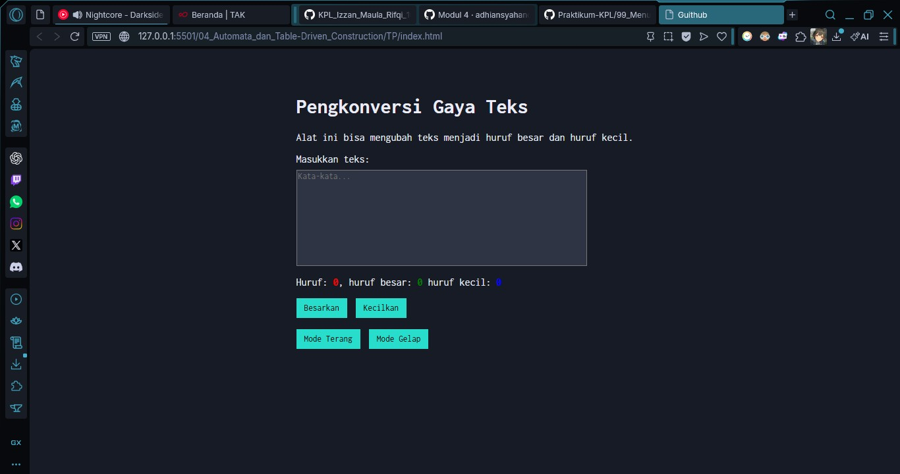

# Tugas Pendahuluan 04: Automata dan Table Driven Construction

**Nama:** Izzan Maula Rifqi  
**NIM:** 103122430009  
**Kelas:** SE-08-02  
**Dosen Pengampu:** Yudha Islami Sulistiya  
**Asisten Praktikum:** Adhiansyah Muhammad Pradana Farawowan, Hamid Khaeruman  

## Soal
Tambahkan mode gelap sekaligus untuk editor-kecil dan tombol-tombolnya. Ketentuan warna untuk latar belakang editor-kecil adalah [#2e3443](https://encycolorpedia.com/2e3443), sementara untuk tombol adalah [#29ddcc](https://encycolorpedia.com/29ddcc). Teks untuk tombol tetap mengikuti warna teks sebelumnya.

Untuk menghapus pinggiran tombol, nyatakan properti `border` untuk tidak ditunjukkan.

contoh tampilan

## Program/Kode
Tersedia di [index.html](index.html), [index.css](index.css), dan [index.js](index.js).

## Output

## Deskripsi
Program Konversi gaya teks yang bisa menghitung huruf, huruf kecil, serta huruf besar dan fitur besarkan dan kecilkan huruf. Sekarang sudah ada fitur mode Terang dan Mode Gelap.  
Pada bagian `index.html`, fitur ini dikendalikan oleh dua tombol utama, yaitu `<button id="tombol-terang">Mode Terang</button>` dan `<button id="tombol-gelap">Mode Gelap</button>`.
saat menekan tombol mode gelap, `index.css` akan menyalakan class `.mode-gelap`. Ketika class ini aktif, tata warna halaman akan berubah: latar belakang halaman menjadi gelap `(background-color: #171b25;)` dan warna teks menjadi terang `(color: #EBECF7;)`. Elemen lain juga ikut disesuaikan, seperti kotak input `(.kotak-input)` yang latar belakangnya berubah menjadi `#2e3443`, serta tombol-tombol yang mendapatkan warna latar `#29ddcc`. Serta menghilangkan garis pinggir tombol menggunakan properti `border: none;`.  
Saat menekan tombol mode terang, `index.css` akan mencabut class `.mode-gelap` sehingga tampilannya kembali cerah seperti semula.