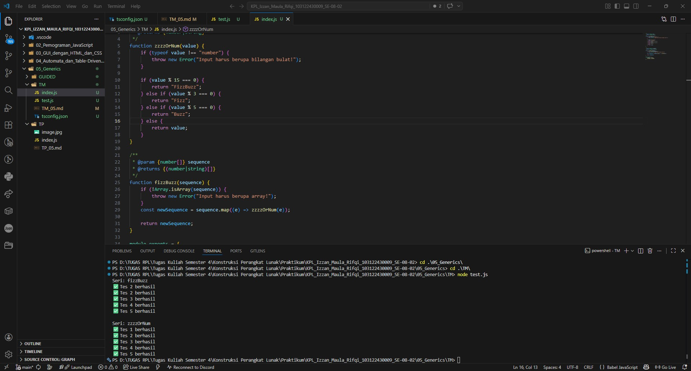

# Tugas Mandiri 05: Generics

**Nama:** Izzan Maula Rifqi <br>
**NIM:** 103122430009 <br>
**Kelas:** SE-08-02 <br>
**Dosen Pengampu:** Yudha Islami Sulistiya <br>
**Asisten Praktikum:** Adhiansyah Muhammad Pradana Farawowan, Hamid Khaeruman <br>

## Soal
Diberikan program index.js seperti ini:
``` 
// Tambah JSDoc di sini
function zzzzOrNum(value) {
    // Ubah kode di sini
}

// Tambah JSDOC di sini
function fizzBuzz(sequence) {
    // Ubah kode di sini

    const newSequence = sequence.map((e) => zzzzOrNum(e));

    return newSequence;
}

module.exports = {
    fizzBuzz: fizzBuzz,
    zzzzOrNum: zzzzOrNum,
};
```
Aturan FizzBuzz kali ini adalah:
1. Fungsi fizzBuzz hanya menerima larik yang semua elemennya terdiri dari bilangan bulat dan mengeluarkan larik pula yang bisa jadi bercampur string dan bilangan
2. Fungsi zzzzOrNum hanya menerima sebuah data tunggal berupa bilangan bulat dan mengembalikan "Fizz", "FizzBuzz", "Buzz", atau bilanga bulat sesuai logikanya
3. Kedua fungsi harus ada dan harus disertai JSDoc sesuai tipe data yang disiratkan dari no. 1, no. 2, dan perilaku yang diharapkan di bawah
4. fizzBuzz harus menggunakan fungsi zzzzOrNum di dalamnya

Gunakan [konfigurasi ini](https://github.com/adhiansyahancha/Praktikum-KPL/blob/c8fdfd7557e5c83d81558b27687d66209d4c5b38/05_Generics/tsconfig.json) untuk `tsconfig.json` dan [test.js](https://github.com/adhiansyahancha/Praktikum-KPL/blob/c8fdfd7557e5c83d81558b27687d66209d4c5b38/05_Generics/test.js) ini untuk menguji kode yang kamu buat.

## Program/Kode
Program Tersedia di [index.js](index.js).

## Output


## Deskripsi
Function `zzzzOrNum` adalah function untuk memproses satu angka, Jika input bukan angka, function akan menghentikan proses dengan `throw new Error`. Jika valid, function memproses angka menggunakan operator sisa bagi (`%`) untuk menentukan apakah akan mengembalikan `"Fizz"`, `"Buzz"`, `"FizzBuzz"`, atau angka itu sendiri. <br>
Function `fizzBuzz` adalah function untuk memproses kumpulan angka, function ini akan menggunakan pengecekan `Array.isArray()` untuk menolak input selain array menggunakan `throw new Error` lalu menggunakan `map()` Untuk mengubah semua angka ke setiap elemen array, lalu mengembalikan array baru yang isinya sudah diproses.