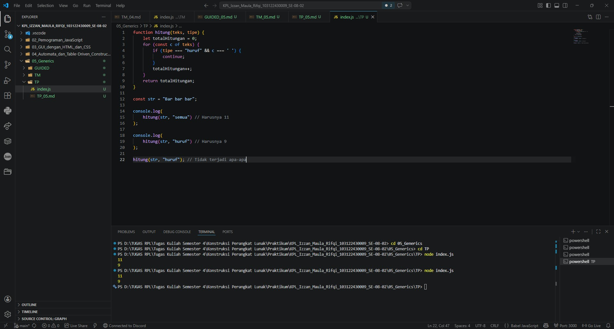

# Tugas Pendahuluan 05: Generics

**Nama:** Izzan Maula Rifqi <br>
**NIM:** 103122430009 <br>
**Kelas:** SE-08-02 <br>
**Dosen Pengampu:** Yudha Islami Sulistiya <br>
**Asisten Praktikum:** Adhiansyah Muhammad Pradana Farawowan, Hamid Khaeruman <br>

## Soal
Ini adalah kode yang mengurus jumlah semua karakter dan jumlah huruf:
```
const str = "Bar bar";

let jumlahSemua = 0;
for (const c of str) { 
    jumlahSemua++; 
}
console.log(total);

let jumlahHuruf = 0;
for (const c of str) { 
    if (c === ' ') continue;
    jumlahHuruf++;
}
console.log(letters);
```
Bagaimana caramu hanya dengan satu fungsi generik bisa mengurus keduanya? <br>
Agar fungsi yang kamu kerjakan benar atau tidak, berikut ini adalah kode tes yang bisa kamu tempelkan:
```
const str = "Bar bar bar";
...
console.log(
   hitung(str, "semua") // Harusnya 11
);

console.log(
  hitung(str, "huruf") // Harusnya 9
);

hitung(str, "huruf"); // Tidak terjadi apa-apa
```

## Program/Kode
Program tersedia di [index.js](index.js)

## Output


## Deskripsi
Daripada memisahkan dua perulangan seperti di Soal, Program ini menggabungkan kedua perulangan itu menjadi satu perulangan. Pada program ini, perulangan disisipkan logika `if (tipe === "huruf" && c === ' ')`. Logika ini bertugas sebagai penyaring, jadi jika fungsi dipanggil dengan perintah `"huruf"`, maka hanya huruf saja yang dihitung dan karakter selain huruf seperti spasi tidak termasuk, saat program mengecek ada karakter spasi, program akan mengeksekusi perintah `continue` untuk melompati hitungan spasi tersebut, Namun jika perintahnya adalah `"semua"`, program akan secara otomatis menambahkan angka hitungan huruf karena spasi termasuk.