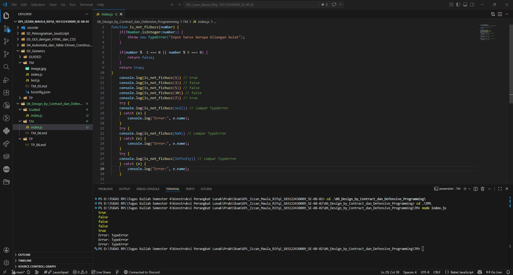

# Tugas Mandiri 06: Design by Contract dan Defensive Programming

**Nama:** Izzan Maula Rifqi <br>
**NIM:** 103122430009 <br>
**Kelas:** SE-08-02 <br>
**Dosen Pengampu:** Yudha Islami Sulistiya <br>
**Asisten Praktikum:** Adhiansyah Muhammad Pradana Farawowan, Hamid Khaeruman <br>

## Soal
Lindungi kode ini dari bilangan-bilangan "fizz buzz"!
<br>

Tugasmu adalah membuat fungsi yang menolak bilangan-bilangan kelipatan 3, 5, atau 15, menerima bilangan-bilangan bukan "fizz buzz", dan melempar yang bukan bilangan bulat.
```
function is_not_fizzbuzz(number) {
  // TODO
}

console.log(is_not_fizzbuzz(1)) // true
console.log(is_not_fizzbuzz(3)) // false
console.log(is_not_fizzbuzz(5)) // false
console.log(is_not_fizzbuzz(30)) // false
console.log(is_not_fizzbuzz(7)) // true
console.log(is_not_fizzbuzz(null)) // Lempar TypeError
console.log(is_not_fizzbuzz(NaN)) // Lempar TypeError
console.log(is_not_fizzbuzz(Infinity)) // Lempar TypeError
```

## Program/Kode
Program Tersedia di [index.js](index.js)

## Output


## Deskripsi
Function ini bertugas untuk menyaring angka dengan menerapkan prinsip defensive programming dan logika matematika. <br>
Sebelum memproses data, function harus memastikan bahwa input yang diterima aman menggunakan `Number.isInteger()` untuk mengecek apakah data yang dimasukkan benar-benar berupa bilangan bulat, jika memasukkan data yang bukan bilangan bulat seperti huruf, `null`, `NaN`, atau `Infinity`, program akan melemparkan eksepsi berupa `throw new TypeError` untuk mencegah eksekusi kode lebih lanjut yang dapat terjadinya error yang lebih fatal. Setelah menyaring angka, function akan mengecek apakah angka tersebut merupakan kelipatan 3 atau 5 menggunakan modulus `%`. Jika angka tersebut modulus dibagi 3 atau 5, maka terdeteksi "fizz buzz", dan akan `return false`. Namun jika angka tersebut tidak modulus dibagi 3 maupun 5, maka akan `return true`.