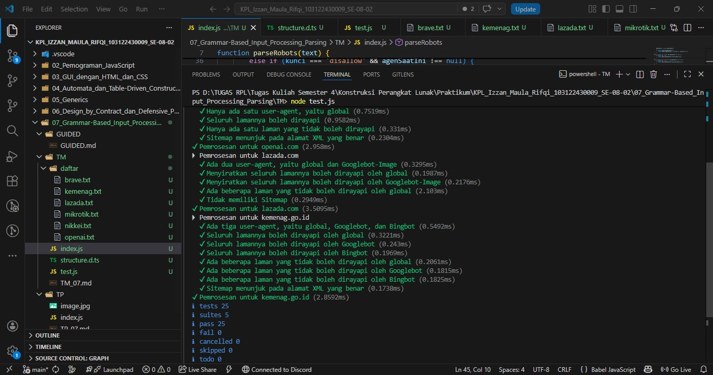

# Tugas Pendahuluan 07: Grammar-based Input Processing

**Nama:** Izzan Maula Rifqi <br>
**NIM:** 103122430009 <br>
**Kelas:** SE-08-02 <br>
**Dosen Pengampu:** Yudha Islami Sulistiya <br>
**Asisten Praktikum:** Adhiansyah Muhammad Pradana Farawowan, Hamid Khaeruman <br>

## Soal
Uraikan robot!

Tugas pada kesempatan kali ini adalah membuat fungsi yang menguraikan isi `robots.txt` menjadi POJO (_plain old JavaScript object_). Empat properti yang perlu diuraikan dijabarkan di bawah berikut.
1. `User-agent` adalah nama robot perayapnya
2. `Allow` adalah daftar halaman-halaman yang boleh dirayap
3. `Disallow` adalah daftar halaman-halaman yang tidak boleh dirayap
4. `Sitemap` adalah sebuah pranala yang menunjuk pada "denah" situs web (biasanya berformat XML)

Kamu akan mengerjakannya di dalam sebuah fungsi bernama `parseRobots` di `index.js` dan. [Buka direktori 07 di sini](https://github.com/adhiansyahancha/Praktikum-KPL/tree/242093e7173cc7885bb362e9dbe0e01b50d59bdc/07_Grammar_Based_Text_Processing) untuk mengunduh berkas yang dimaksud, berkas-berkas `robots.txt` di dalam direktori `daftar`, dan berkas pengujiannya yaitu `test.js`.

Jadi, strukturnya harus seperti ini:
```
|   index.js
|   structure.d.ts // Opsional mau ada atau tidak
|   test.js
\---daftar
        brave.txt
        kemenag.txt
        lazada.txt
        mikrotik.txt
        nikkei.txt
        openai.txt
```
Agar kode yang kamu tulis di `index.js` bekerja atau tidak, jalankan `test.js`. Jika kamu membuat proyek Node (yang ada `package.json`), pastikan untuk membuat impor menjadi CommonJS dengan `type: commonjs`.

Beberapa petunjuk:

1. Manajemen state akan membantu
2. Nilai tambah jika kamu bisa mendeskripsikannya secara code tracing
3. Tidak perlu program untuk membaca TXT, itu sudah dilakukan oleh `test.js`    
4. Hubungi asprak jika ada kendala atau kesalahan

## Program/Kode
Program Tersedia di [index.js](index.js)

## Output


## Deskripsi
Function `parseRobots` ini berfungsi untuk membaca teks mentah dari dokumen `robots.txt` lalu merombaknya menjadi sebuah objek JavaScript yang sangat terstruktur dan mudah diolah oleh sistem. Pertama program in akan menyiapkan objek kosong yang memiliki 2 ruang yaitu ruang `agents` untuk menyimpan aturan spesifik setiap robot, dan ruang `Sitemap` untuk menyimpan link situs, lalu memecah keseluruhan teks menjadi baris-baris terpisah. Kemudian Program menyiapkan sebuah manajemen state bernama `agenSaatIni` yang berfungsi untuk melacak identitas robot mana yang sedang dibacakan aturannya. Saat program mulai membaca teks baris demi baris ia akan langsung membersihkan teks dari spasi kosong dan setiap kali menemukan kata kunci `user-agent`, ia akan mengubah nama robot tersebut menjadi huruf kecil, mengingatnya ke dalam state, dan langsung membuatkan penyimpanan khusus untuk robot itu jika belum ada. Dengan Memori state, Ketika baris-baris berikutnya berisi perintah `allow` atau `disallow`, Program akan langsung memasukkan alamat halaman tersebut ke dalam penyimpanan milik robot yang sedang aktif. Lalu jika di tengah jalan program menemukan kata kunci `sitemap` atau `host`, program akan langsung menyimpannya ke ruang utama tanpa memedulikan robot mana yang sedang mendominasi. Setelah seluruh baris berhasil dievaluasi dan dikelompokkan ke tempatnya masing-masing, program akan return struktur data utuh yang sudah rapi.