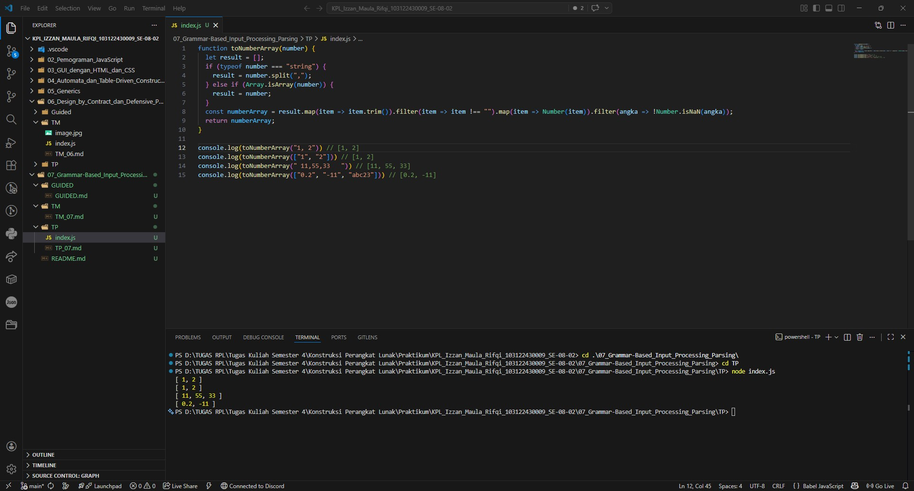

# Tugas Pendahuluan 07: Grammar-based Input Processing

**Nama:** Izzan Maula Rifqi <br>
**NIM:** 103122430009 <br>
**Kelas:** SE-08-02 <br>
**Dosen Pengampu:** Yudha Islami Sulistiya <br>
**Asisten Praktikum:** Adhiansyah Muhammad Pradana Farawowan, Hamid Khaeruman <br>

## Soal
Buatlah fungsi yang mengubah deretan angka bertipe string menjadi larik angka.
```
function toNumberArray(number) {
  // TODO
}

console.log(toNumberArray("1, 2")) // [1, 2]
console.log(toNumberArray(["1", "2"])) // [1, 2]
console.log(toNumberArray(" 11,55,33   ")) // [11, 55, 33]
console.log(toNumberArray(["0.2", "-11", "abc23"])) // [0.2, -11]
```

## Program/Kode
Program Tersedia di [index.js](index.js)

## Output


## Deskripsi
Function ini bertugas untuk melakukan parsing, dengan cara membaca string yang dipisahkan oleh koma maupun sekumpulan string di dalam array, lalu menjadi Array baru yang hanya berisi angka. <br>
Function ini mengecek tipe data menggunakan `typeof` dan `Array.isArray()`. Jika berupa string tunggal seperti "1, 2", akan dipecah menggunakan `.split(",")` agar menjadi array. Setelah data berbentuk array, function menggunakan `.map()` dan `.trim()` untuk menghapus spasi berlebih di kiri dan kanan setiap elemen dan menghapus elemen kosong (misalnya akibat dua tanda koma yang berdekatan) menggunakan `.filter()` dan `.map()` untuk mengonversi tipe data dari teks menjadi angka menggunakan `Number()`.Jika tidak mengandung angka sama sekali (seperti "abc23") akan otomatis menjadi `NaN`.Function juga menggunakan `.filter(angka => !Number.isNaN(angka))` untuk menyaring dan membuang semua NaN, lalu `return array`.