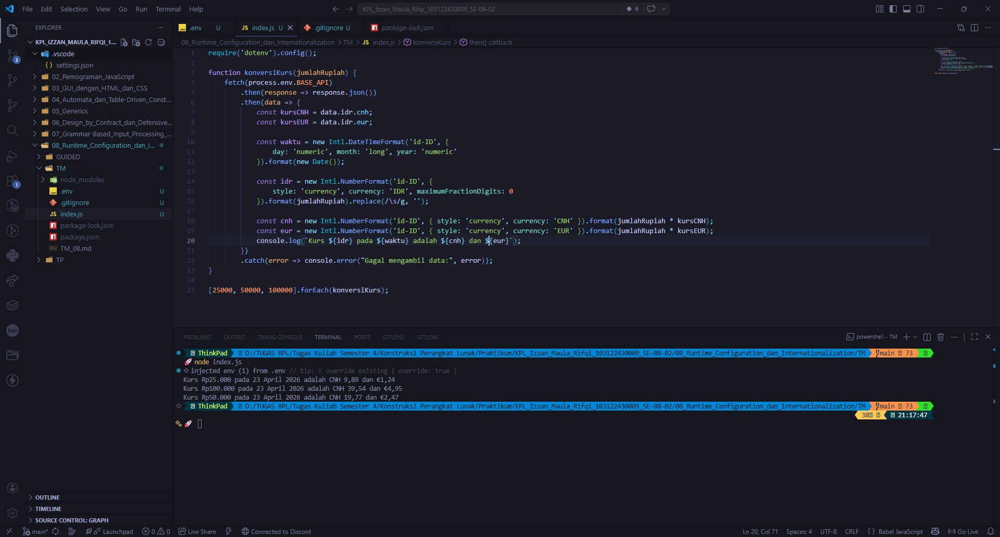

# Tugas Mandiri 08: Runtime Configuration dan Internationalization

**Nama:** Izzan Maula Rifqi  
**NIM:** 103122430009  
**Kelas:** SE-08-02  
**Dosen Pengampu:** Yudha Islami Sulistiya  
**Asisten Praktikum:** Adhiansyah Muhammad Pradana Farawowan, Hamid Khaeruman  

## Soal
Waktunya menukar uang!

Pada tugas ini kamu akan membuat program yang menampilkan kurs rupiah (IDR) terhadap renminbi luar Tiongkok (CNH) dan euro (EUR). Gunakan [link API ini](https://cdn.jsdelivr.net/npm/@fawazahmed0/currency-api@latest/v1/currencies/idr.json) untuk mengambil data.  
Tantangan:
1. Simpanlah URL API ke dalam .env sebagai BASE_API
2. Gunakan Intl untuk memformat nilai mata uang dan waktu kamu mengambil data kurs.
3. Hapus pesan promosi dotenv

Lalu pastikan outputnya tampak seperti di bawah ini.  

Ujilah dengan Rp25000, Rp50000, dan Rp100000.
## Program/Kode
Program Tersedia di [index.js](index.js)

## Output

## Deskripsi
Program ini adalah sebuah alat konversi mata uang berbasis web yang mengambil data kurs dari API eksternal. Program ini menggunakan `fetch` untuk mengambil data kurs dari URL yang disimpan dalam file `.env` sebagai `BASE_API`. Setelah data diterima, program memformat waktu pengambilan data dan nilai mata uang menggunakan `Intl.DateTimeFormat` dan `Intl.NumberFormat` untuk memastikan format yang sesuai dengan lokal Indonesia (id-ID), lalu di konversikan dari nilai rupiah (IDR) ke CNH dan EURO. setelah itu ditest dengan nomial Rp25000, Rp50000, dan Rp100000, lalu hasil konversi ditampilkan dalam format yang jelas, menunjukkan nilai rupiah (IDR) dan hasil konversi ke CNH dan EUR pada waktu tertentu.
