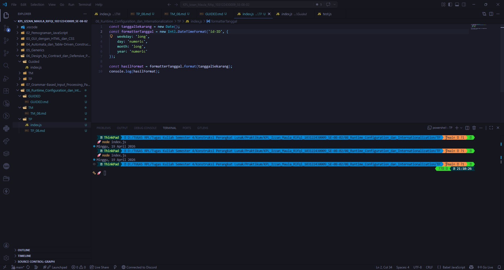

# Tugas Pendahuluan 08: Runtime Configuration dan Internationalization

**Nama:** Izzan Maula Rifqi <br>
**NIM:** 103122430009 <br>
**Kelas:** SE-08-02 <br>
**Dosen Pengampu:** Yudha Islami Sulistiya <br>
**Asisten Praktikum:** Adhiansyah Muhammad Pradana Farawowan, Hamid Khaeruman <br>

## Soal
Tampilkan tanggal sekarang dengan format seperti ini:
```
Sabtu, 18 April 2026
```
Nilai waktu tidak harus sama, asalkan formatnya benar dan bisa tampil di komputer terpisah pada waktu tertentu. Gunakan `Intl.DateTimeFormat` (bukan string manual).

## Program/Kode
Program Tersedia di  [index.js](index.js)

## Output


## Deskripsi
Ini adalah program untuk menampilkan pemformatan waktu saat ini, System akan membaca tanggal bawaan sistem menggunakan `new Date();`, setelah membaca, program akan menyusun kata dari tanggalan bawaan sistem menggunakan `Intl.DateTimeFormat` lalu mengaturnya ke kode wilayah `'id-ID'` supaya kosakata yang dihasilkan menggunakan bahasa indonesia, setelah itu program mengatur serangkaian instruksi weekday, day, month, year untuk menjabarkan nama hari, angka tanggal, dan nama bulan, dan angka tahun secara lengkap sesuai tipe datanya, lalu menampilkannya dalam kalimat teks utuh string yang bisa dibaca.