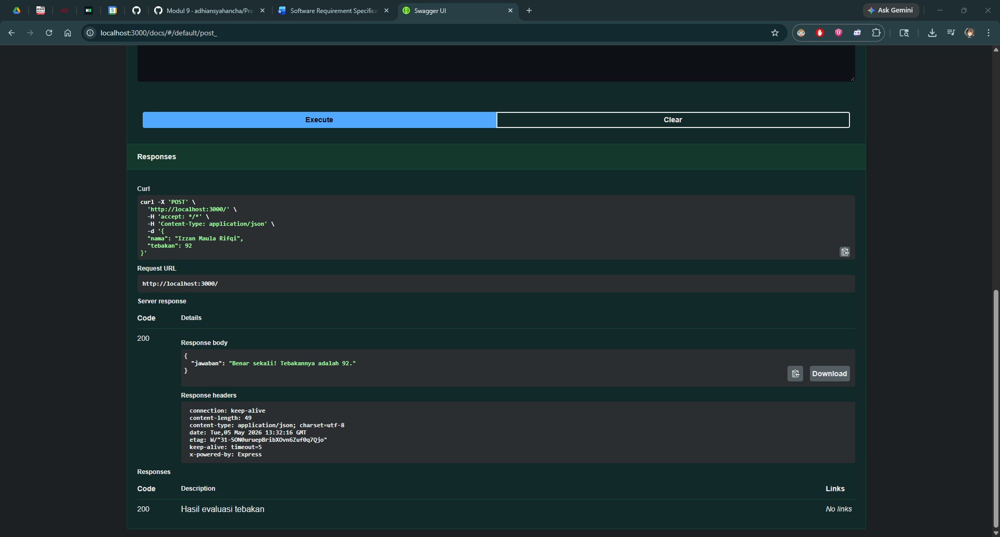
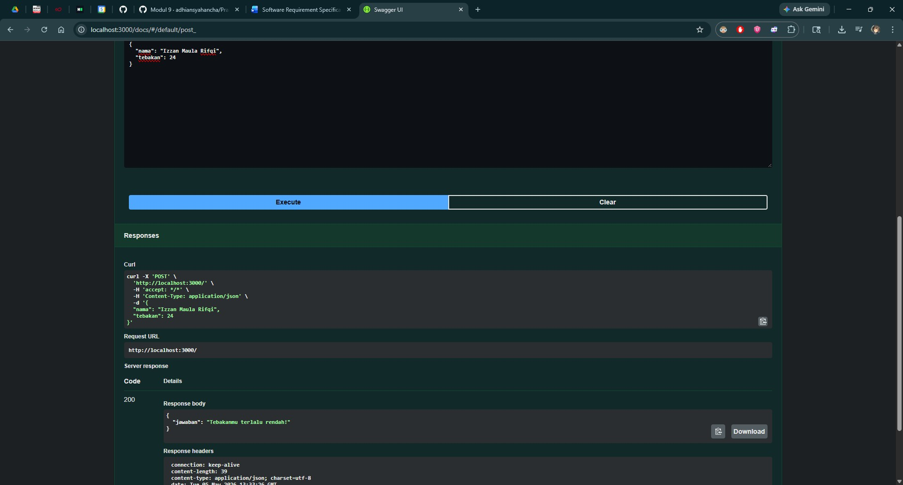

# Tugas Mandiri 09: API Design dan Construction Using Swagger

**Nama:** Izzan Maula Rifqi <br>
**NIM:** 103122430009 <br>
**Kelas:** SE-08-02 <br>
**Dosen Pengampu:** Yudha Islami Sulistiya <br>
**Asisten Praktikum:** Adhiansyah Muhammad Pradana Farawowan, Hamid Khaeruman <br>

## Soal
Mari kita main tebak-tebakan angka acak!

Tugasmu adalah membuat API yang terdiri dari satu endpoint saja, yaitu `POST /`. Ketika kita melakkukan `POST`, formatnya adalah seperti di bawah ini. <br>
```
{
  "nama": "Hamid",
  "tebakan": 24
}
```
Jika tebakan benar. <br>
```
{
    "jawaban": "Benar sekali! Tebakannya adalah 24."
}
```
Jika tebakan terlalu tinggi. <br>
```
{
    "jawaban": "Tebakanmu terlalu tinggi!"
}
```
Jika tebakan terlalu rendah. <br>
```
{
    "jawaban": "Tebakanmu terlalu rendah!"
}
```
Beberapa aturan:
1. Angka acak yang dihasilkan harus tetap dan tidak boleh berubah setiap kali permintaan API dilakukan, tetapi boleh berubah setiap harinya atau dibuat tetap selamanya
2. Rentang harus di antara 1-100
3. Nama harus sensitif terhadap besar kecil huruf (mis. hamid dan Hamid akan menghasilkan angka acak yang berbeda)
4. Tidak menggunakan pustaka apapun, murni mengandalkan nama dan tebakan

Penjelasan untuk nomor 1: Jika namanya `Hamid`, ia akan diharapkan tetap pada nilai tebakan 24 mau kamu melakukan 100 kali permintaan. Tidak ada jawaban benar di sini (`Hamid` tidak harus `24`, bebas mau dibuat acak seperti apa yang penting harus tetap).

## Program Kode
Program tersedia di [index.js](index.js) dan [swagger.js](swagger.js)

## Output



## Deskripsi
Program ini adalah server web Node.js yang dibangun menggunakan Express.js. Program ini melakukan inisialisasi dasar dengan mengimpor modul `express`, menentukan `PORT 3000`, dan memuat konfigurasi OpenAPI dari berkas terpisah melalui `const { swaggerUi, specs } = require('./swagger')` lalu konfigurasi ini kemudian diterapkan untuk menampilkan halaman interface Swagger pada route `/docs` menggunakan perintah `app.use('/docs', swaggerUi.serve, swaggerUi.setup(specs))`, di mana sebelumnya program juga memanggil `app.use(express.json())` agar dapat menerima body. <br>
Endpoint `POST /`, bertujuan untuk mengevaluasi permainan tebak-tebakan angka berdasarkan input nama menggunakan format JSDoc OpenAPI/Swagger dengan diawali anotasi `@swagger` yang mendefinisikan path `/`, metode `post`, definisi skema `requestBody`, dan pesan berhasil `responses: 200: description: Hasil evaluasi tebakan`. Di dalam blok fungsi routing `app.post('/', (req, res) => { ... })`, program mengekstrak data dari klien dengan menyimpan nilai `nama` dan `tebakan` yang diambil dari objek `req.body`, lalu program melakukan iterasi pada `nama` untuk menjumlahkan nilai ASCII setiap karakternya menggunakan metode bawaan `nama.charCodeAt(i)`. Hasil penjumlahan ASCII tersebut lalu di-modulo 100 dan ditambah 1 untuk menghasilkan `targetAngka` yang konsisten, case-sensitive, dan berada dalam rentang 1-100. Lalu program membandingkan nilai `tebakan` dengan `targetAngka` dan mengirimkan hasil perbandingannya kepada klien menggunakan perintah `res.status(200).json(...)` yang berisi keterangan "Benar", "Terlalu tinggi", atau "Terlalu rendah".