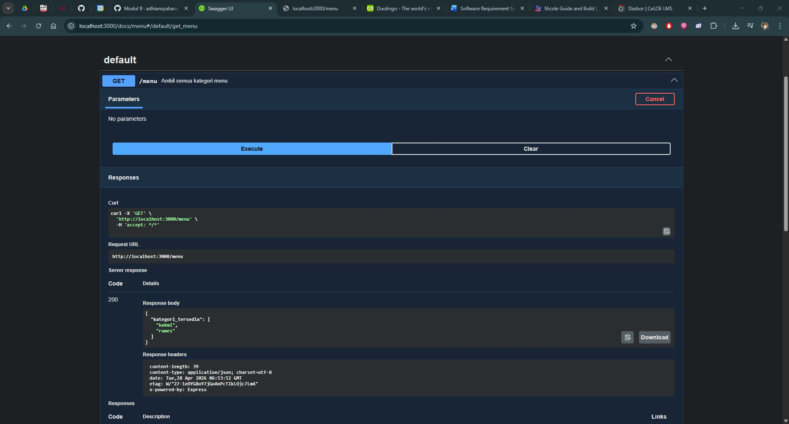
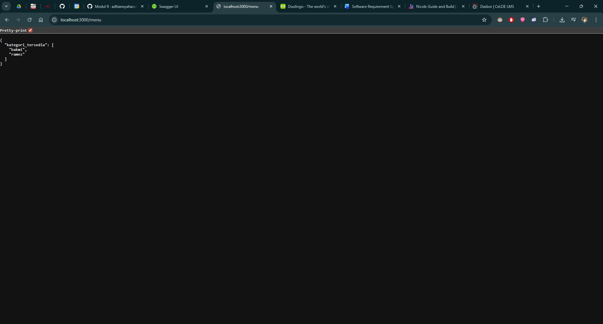

# Tugas Pendahuluan 09: API Design dan Construction Using Swagger

**Nama:** Izzan Maula Rifqi  
**NIM:** 103122430009  
**Kelas:** SE-08-02  
**Dosen Pengampu:** Yudha Islami Sulistiya  
**Asisten Praktikum:** Adhiansyah Muhammad Pradana Farawowan, Hamid Khaeruman  

## Soal
Buatlah satu endpoint lagi beserta dokumentasi OpenAPI-nya, yaitu `GET /menu` yang menampilkan daftar semua nama kategori menu yang ada.

Dokumentasi:
  

Hasil `GET`:  

## Program/Kode
Program Tersedia di [index.js](index.js) dan  [swagger.js](swagger.js)

## Output

## Deskripsi
Program ini adalah server web Node.js yang dibangun menggunakan Express.js. sebelumnya, program melakukan inisialisasi dasar dengan mengimpor modul `express`, menentukan `PORT 3000`, dan memuat konfigurasi OpenAPI dari berkas terpisah melalui `const { specs, swaggerUi } = require('./swagger.js')` lalu konfigurasi ini kemudian diterapkan untuk menampilkan halaman interface dokumentasi Swagger pada route `/docs` menggunakan perintah `app.use('/docs', swaggerUi.serve, swaggerUi.setup(specs))`, setelah itu objek bernama `menuData` didefinisikan sebagai tempat penyimpanan data mentah yang berisi kategori makanan seperti `"bakmi"` dan `"rames"` beserta daftar menu dan harganya.  
Endpoint `GET /menu`, bertujuan untuk mengembalikan daftar semua nama kategori makanan yang tersedia menggunakan format JSDoc OpenAPI/Swagger dengan diawali anotasi @swagger yang mendefinisikan path `/menu`, metode `get`, dan pesan berhasil `responses: 200: description: Daftar kategori berhasil diambil`.
Di dalam blok fungsi routing `app.get('/menu', (req, res) => { ... })`, program mengekstrak nama-nama kategori makanan dari dalam objek data, menggunakan metode bawaan `Object.keys(menuData)`, yang hanya akan menarik main key yaitu `"bakmi"` dan `"rames"` lalu menyimpannya ke dalam sebuah array pada variabel `daftarKategori`, lalu program mengirimkan hasil ekstraksi kepada klien menggunakan perintah `res.status(200).json({ kategori_tersedia: daftarKategori })`, untuk memastikan data yang dikembalikan diformat secara otomatis sebagai JSON yang rapi.