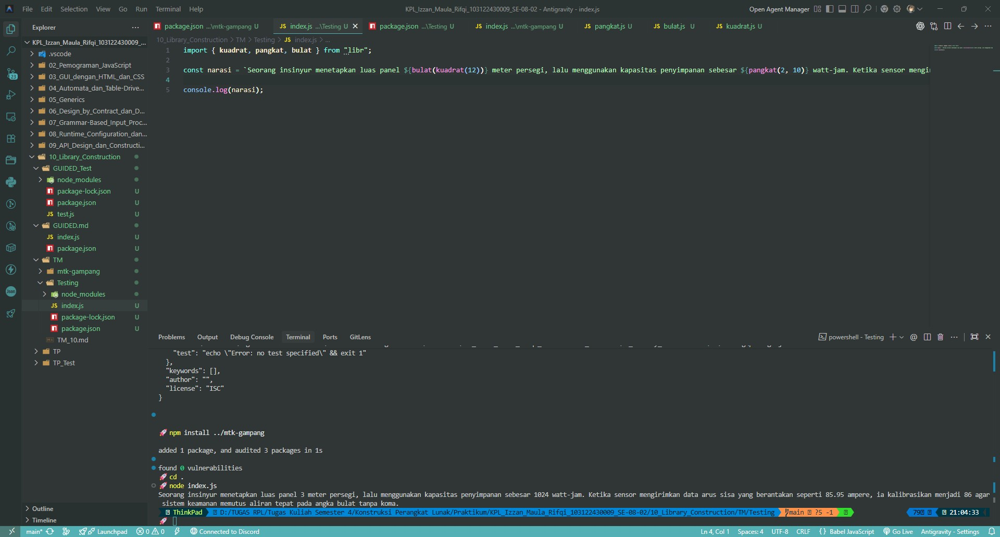

# Tugas Mandiri 10: Library Construction

**Nama:** Izzan Maula Rifqi <br>
**NIM:** 103122430009 <br>
**Kelas:** SE-08-02 <br>
**Dosen Pengampu:** Yudha Islami Sulistiya <br>
**Asisten Praktikum:** Adhiansyah Muhammad Pradana Farawowan, Hamid Khaeruman <br>

## Soal
Buatkan pustaka yang rapi!

Pada tugas ini buatlah sebuah proyek baru bernama `mtk-gampang`. Struktur proyeknya wajib diatur seperti di bawah ini.

```
|── package.jso
├── index.js
├── lib/
   ├── kuadrat.js
   ├── pangkat.js
   |── bulat.js
```
Setiap berkas lib hanya memiliki satu fungsi saja.

1. `pangkat.js` berisi fungsi `pangkat(x, y)` yang mengembalikan nilai akhir dari x pangkat y.
2. `bulat.js` berisi fungsi `bulat(x)` yang mengubah bentuk bilangan non-bulat menjadi bulat (mis. `-4.25` menjadi `-4`) .
3. `kuadrat.js` berisi fungsi `kuadrat(x)` yang mengembalikan nilai akar kuadrat 2 dari `x`.

Satu batasannya adalah fungsi-fungsi ini harus diakses dari `index.js` (sebagai nilai dari properti `main`), bukan dari `lib` masing-masing.

Jika sudah selesai, buatlah proyek baru lagi dan instal pustaka yang kamu buat secara lokal. Pada `index.js`-nya, gunakan kode ini untuk memastikan bahwa kamu berhasil melakukannya.

```
import { kuadrat, pangkat, bulat } from "libr";

const narasi = `Seorang insinyur menetapkan luas panel ${bulat(kuadrat(12))} meter persegi, lalu menggunakan kapasitas penyimpanan sebesar ${pangkat(2, 10)} watt-jam. Ketika sensor mengirimkan data arus sisa yang berantakan seperti 85.95 ampere, ia kalibrasikan menjadi ${bulat(85.95)} agar sistem keamanan memutus aliran tepat pada angka bulat tanpa koma.`;

/**
 * Seorang insinyur menetapkan luas panel 3 meter persegi, lalu menggunakan kapasitas penyimpanan sebesar 1024 watt-jam. Ketika sensor mengirimkan data arus sisa yang berantakan seperti 85.95 ampere, ia kalibrasikan menjadi 85 agar sistem keamanan memutus aliran tepat pada angka bulat tanpa koma.
 * /

console.log(narasi);
```

## Kode Progam
Kode Program tersedia di [index.js](Testing/index.js)

## Output


## Deskripsi
Ini adalah program dimana kita membuat sebuah library matematika berbasis ES Modules dengan nama `mtk-gampang` yang memuat tiga fungsi utama di dalam folder `lib`, yaitu fungsi `pangkat` untuk operasi eksponensial, `bulat` untuk pembulatan angka dengan menggunakan `Math.round()`, dan `kuadrat` untuk menghitung akar kuadrat dengan menggunakan `Math.sqrt()`. Ketiga fungsi tersebut diekspor kembali melalui file `index.js` menggunakan sintaks `export { pangkat } from './lib/pangkat.js'`, lalu library ini juga diatur agar menggunakan format modul modern dengan penambahan properti `"type": "module"` pada `package.json`. Untuk selanjutnya, library ini diuji di dalam proyek terpisah pada folder `Testing` dengan menambahkannya sebagai dependensi lokal di file `package.json` menggunakan jalur `"libr": "file:../mtk-gampang"`,lalu di file `Testing/index.js`, kita memanggil library matematika tersebut menggunakan `import { kuadrat, pangkat, bulat } from "libr";`, lalu kita mengoperasikan`kuadrat(12)`, `pangkat(2, 10)`, dan `bulat(85.95)` yang kemudian hasilnya akan ditampilkan menggunakan `console.log`.
