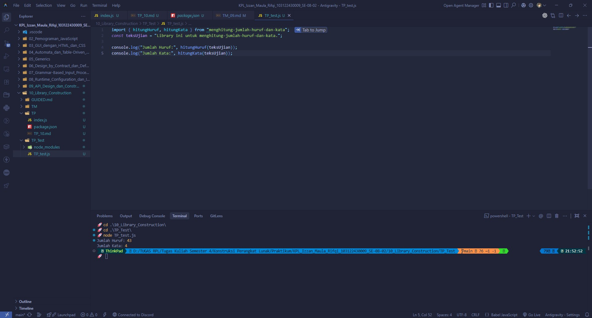

# Tugas Mandiri 10: Library Construction

**Nama:** Izzan Maula Rifqi  
**NIM:** 103122430009  
**Kelas:** SE-08-02  
**Dosen Pengampu:** Yudha Islami Sulistiya  
**Asisten Praktikum:** Adhiansyah Muhammad Pradana Farawowan, Hamid Khaeruman  

## Soal
Buatlah pustaka JavaScript yang menyediakan utilitas berupa dua fungsi yang menghitung jumlah huruf dan jumlah kata.

Kriteria:
1. Hanya alfabet A hingga Z yang dihitung (besar dan kecil)
2. Spasi tidak dihitung
3. Pustaka bisa diimpor

## Program Kode
Program tersedia di [index.js](index.js) dan [TP_test.js](../TP_Test/TP_test.js)

## Output

## Deskripsi
Program ini adalah membuatan library JavaScript sendiri untuk menghitung jumlah huruf dan jumlah kata dari sebuah kalimat. Pertama-tama mengekspor dua fungsi, yaitu `hitungHuruf(teks)` dan `hitungKata(teks)`. Pada fungsi `hitungHuruf`, memastikan inputnya berupa teks, lalu menggunakan `teks.match(/[a-zA-Z]/g)` untuk mengambil huruf alfabetnya saja, sehingga spasi dan tanda baca otomatis tidak ikut terhitung. Sementara pada fungsi `hitungKata`, membersihkan sisa spasi di ujung kalimat memakai `teks.trim()`, memecah kalimat menjadi kumpulan kata dengan `teks.split(/\s+/)`, lalu menggunakan operasi `filter` agar spasi yang berlebih di tengah kalimat tidak ikut dihitung sebagai kata.  
Setelah modul ini siap, memberikan nama `"menghitung-jumlah-huruf-dan-kata"` di file `package.json` agar sistem mengenalinya sebagai sebuah *package*. untuk membuktikan apakah ini bisa dipakai, pindah ke `TP_Test` dan menginstal lokal tadi di sana. Setelah terpasang, tinggal memanggilnya di dalam file `TP_test.js` menggunakan perintah `import { hitungHuruf, hitungKata } from "menghitung-jumlah-huruf-dan-kata"`. Di sinilah menguji buatan dengan memasukkan kalimat sampel `"Library ini untuk menghitung-jumlah-huruf-dan-kata."`, lalu mencetak hasilnya dengan `console.log(...)`. Hasil di layar pada akhirnya menunjukkan bahwa buatan sukses terhubung dan berfungsi dengan sempurna layaknya sungguhan!