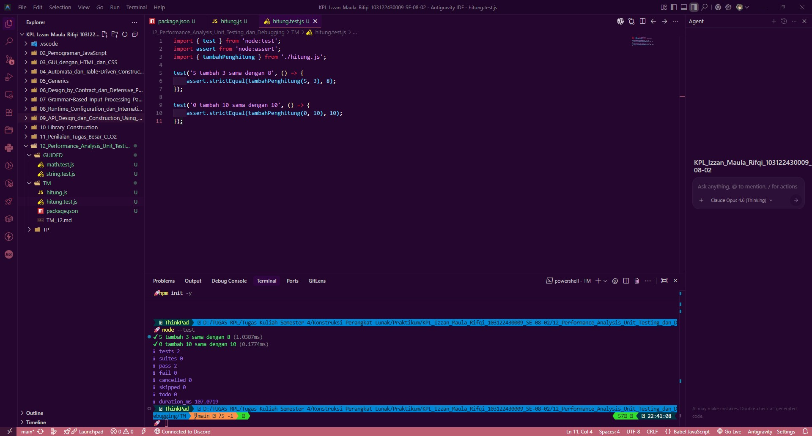

# Tugas Mandiri 12: Performance Analysis, Unit Testing, dan Debugging

**Nama:** Izzan Maula Rifqi <br>
**NIM:** 103122430009 <br>
**Kelas:** SE-08-02 <br>
**Dosen Pengampu:** Yudha Islami Sulistiya <br>
**Asisten Praktikum:** Adhiansyah Muhammad Pradana Farawowan, Hamid Khaeruman <br>

## Soal
Tambah dan tambah!

Fungsi di bawah ini melakukan penjumlaha pada penghitung (counter), yang sesederhana menambahk jumlah jika kamu menekan tombol. <br>
`hitung.js`
```
function tambahPengitung(terkini, jumlah) {
  terkini = terkini + jumlah;
  return terkini;
}
```
`hitung.test.js`
```
import { test } from 'node:test';
import assert from 'node:assert';
import { tambahPengitung } from './hitung.js';

test('5 tambah 3 sama dengan 8', () => {
  assert.strictEqual(tambahPengitung(5, 3), 8);
});

test('0 tambah 10 sama dengan 10', () => {
  assert.strictEqual(tambahPengitung(0, 10), 10);
});

```
Bisakah kamu tunjukkan apakah kode sudah benar atau bagian mana yang perlu diperbaiki beserta alasannya?

## Program Kode
Program tersedia di [hitung.js](hitung.js) dan [hitung.test.js](hitung.test.js)

## Output


## Deskripsi
1. Sistem Modul (ES Modules): Pada berkas `hitung.test.js`, kode memanggil fungsi menggunakan sintaks modern `import { tambahPenghitung } from './hitung.js';`.
2. Akses Terkunci: Dalam JavaScript modern, semua fungsi atau variabel di dalam sebuah berkas secara otomatis bersifat privat (hanya bisa digunakan di dalam berkas itu sendiri).
3. Error Import: Karena pada kode asli tidak ada kata kunci export, berkas `hitung.test.js` tidak akan bisa "melihat" atau "menarik" fungsi tersebut. Jika dipaksakan jalan, Node.js akan memberikan error berbunyi: `SyntaxError: The requested module './hitung.js' does not provide an export named 'tambahPenghitung'.`
4. Fungsi Kata Kunci export: Dengan menambahkan kata `export` di depan deklarasi fungsi, kita secara eksplisit membuka gemboknya dan memberi izin agar fungsi `tambahPenghitung` bisa diakses dan diimpor oleh berkas lain (dalam hal ini, berkas pengujian `hitung.test.js`).
5. Agar sintaks import dan export ini dikenali oleh Node.js, harus menambahkan berkas `package.json`. 