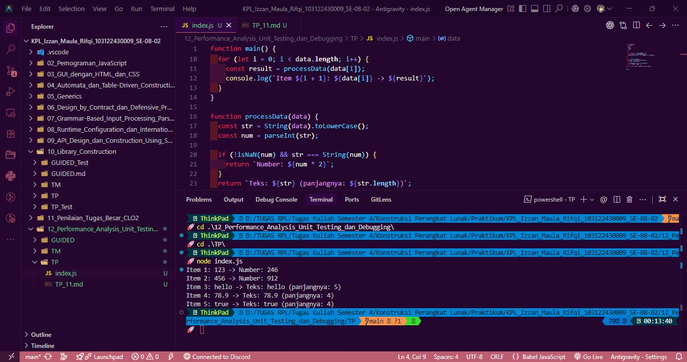

# Tugas Pendahuluan 12: Performance Analysis, Unit Testing, dan Debugging

**Nama:** Izzan Maula Rifqi <br>
**NIM:** 103122430009 <br>
**Kelas:** SE-08-02 <br>
**Dosen Pengampu:** Yudha Islami Sulistiya <br>
**Asisten Praktikum:** Adhiansyah Muhammad Pradana Farawowan, Hamid Khaeruman <br>

## Soal
Cobalah untuk menangkap kecacatan dalam kode ini
```
function main() {
  const data = [
    "123",
    456,
    "hello",
    78.9,
    true,
  ];

  for (let i = 0; i < data.length; i++) {
    const result = processData(data[i]);
    console.log(`Item ${i + 1}: ${data[i]} -> ${result}`);
  }
}

function processData(data) {
  const str = data.toLowerCase();
  const num = parseInt(str);
  if (!isNaN(num) && str === String(num)) {
    return `Number: ${num * 2}`;
  }
  return `Teks: ${str} (panjangnya: ${str.length})`;
}

main();
```

## Program Kode
Program tersedia di [index.js](index.js)

## Output


## Deskripsi
Program ini memiliki kecacatan pada kode `index.js` yang bertujuan untuk melakukan iterasi dan pemrosesan pada sebuah array dengan tipe data campuran (String, Number, dan Boolean) dan harus melakukan **Debugging**.
Ketika program awal dijalankan, eksekusi mengalami crash dan error: `TypeError: data.toLowerCase is not a function`. <br>
Masalah terletak pada fungsi `processData` di baris `const str = data.toLowerCase();`, Karena metode `.toLowerCase()` adalah fungsi JavaScript yang hanya mengenali tipe data String. Namun, dalam array pada kode `index.js`, mengandung tipe data Number (456, 78.9) dan Boolean (true), sehingga menyebabkan program gagal mengeksekusi metode tersebut saat iterasi mencapai elemen non-teks. <br>
Untuk menyelesaikan masalah ini, diterapkann konversi tipe data dimana modifikasi dilakukan dengan memastikan setiap parameter yang masuk diubah tipe datanya menjadi `String` terlebih dahulu sebelum diproses.

**Kode Awal:**
```
function main() {
  const data = [
    "123",
    456,
    "hello",
    78.9,
    true,
  ];

  for (let i = 0; i < data.length; i++) {
    const result = processData(data[i]);
    console.log(`Item ${i + 1}: ${data[i]} -> ${result}`);
  }
}

function processData(data) {
  const str = data.toLowerCase();
  const num = parseInt(str);
  if (!isNaN(num) && str === String(num)) {
    return `Number: ${num * 2}`;
  }
  return `Teks: ${str} (panjangnya: ${str.length})`;
}

main();
```
**Kode Setelah Debugging:**
```
function main() {
  const data = [
    "123",
    456,
    "hello",
    78.9,
    true,
  ];

  for (let i = 0; i < data.length; i++) {
    const result = processData(data[i]);
    console.log(`Item ${i + 1}: ${data[i]} -> ${result}`);
  }
}

function processData(data) {
  const str = String(data).toLowerCase(); 
  const num = parseInt(str);

  if (!isNaN(num) && str === String(num)) {
    return `Number: ${num * 2}`;
  }
  return `Teks: ${str} (panjangnya: ${str.length})`;
}

main();
```
Program, mengevaluasinya menggunakan `parseInt()`, dan mengembalikan format kalimat sesuai dengan tipe data aslinya.