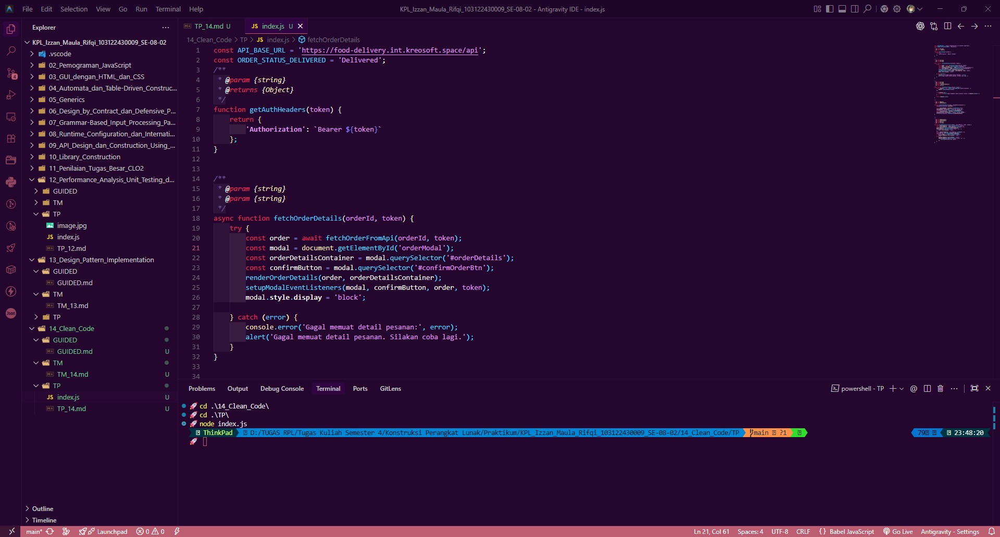

# Tugas Pendahuluan 14: Clean Code

**Nama:** Izzan Maula Rifqi <br>
**NIM:** 103122430009 <br>
**Kelas:** SE-08-02 <br>
**Dosen Pengampu:** Yudha Islami Sulistiya <br>
**Asisten Praktikum:** Adhiansyah Muhammad Pradana Farawowan, Hamid Khaeruman <br>

## Soal
Kode ini tampak baik dan bagus, tetapi menyalahi beberapa prinsip kode bersih. Bisakah kamu melakukan refaktorisasi? Dimodifikasi dari [amrrwael/Delivery-website-Hits](https://github.com/amrrwael/Delivery-website-Hits).

Sebagai konteks, fungsi di bawah ini menampilkan rincian pesanan di modal dan jika klik konfirmasi, sistem apa menyimpannya.
```
function fetchOrderDetails(orderId, token) {
    fetch(`https://example.com/api/order/${orderId}`, {
        headers: {
            'Authorization': token
        }
    })
    .then(response => {
        if (!response.ok) {
            throw new Error('Failed to fetch order details');
        }
        return response.json();
    })
    .then(order => {
        // Display order info
        const modal = document.getElementById('orderModal');
        const detailsDiv = modal.querySelector('#orderDetails');
        detailsDiv.innerHTML = '';

        const header = document.createElement('h3');
        header.textContent = `Order ID: ${order.id}`;
        detailsDiv.appendChild(header);

        const status = document.createElement('p');
        status.textContent = `Status: ${order.status}`;
        detailsDiv.appendChild(status);

        // Show modal
        modal.style.display = 'block';

        // Setup close button
        const closeBtn = modal.querySelector('.close');
        closeBtn.addEventListener('click', () => {
            modal.style.display = 'none';
        });

        // Setup confirm button
        const confirmBtn = modal.querySelector('#confirmOrderBtn');
        if (order.status === 'Delivered') {
            confirmBtn.style.display = 'none';
        } else {
            confirmBtn.addEventListener('click', () => {
                confirmOrder(order.id, token);
            });
        }
    })
    .catch(error => {
        console.error('Error:', error);
    });
}
```

## Program Kode
Program tersedia di [index.js](index.js)

## Output


## Deskripsi

Sumber: [Delivery-website-Hits](https://github.com/amrrwael/Delivery-website-Hits)

Kode Sebelum Refaktorisasi (Original):
```javascript
function fetchOrderDetails(orderId, token) {
    fetch(`https://example.com/api/order/${orderId}`, {
        headers: {
            'Authorization': token
        }
    })
    .then(response => {
        if (!response.ok) {
            throw new Error('Failed to fetch order details');
        }
        return response.json();
    })
    .then(order => {
        const modal = document.getElementById('orderModal');
        const detailsDiv = modal.querySelector('#orderDetails');
        detailsDiv.innerHTML = '';

        const header = document.createElement('h3');
        header.textContent = `Order ID: ${order.id}`;
        detailsDiv.appendChild(header);

        const status = document.createElement('p');
        status.textContent = `Status: ${order.status}`;
        detailsDiv.appendChild(status);

        modal.style.display = 'block';

        const closeBtn = modal.querySelector('.close');
        closeBtn.addEventListener('click', () => {
            modal.style.display = 'none';
        });

        const confirmBtn = modal.querySelector('#confirmOrderBtn');
        if (order.status === 'Delivered') {
            confirmBtn.style.display = 'none';
        } else {
            confirmBtn.addEventListener('click', () => {
                confirmOrder(order.id, token);
            });
        }
    })
    .catch(error => {
        console.error('Error:', error);
    });
}
```

Analisis Pelanggaran Prinsip Clean Code:
1. Single Responsibility Principle (SRP), yaitu Fungsi Melakukan Terlalu Banyak Hal
Fungsi `fetchOrderDetails` melakukan empat tanggung jawab sekaligus: <br>
    a. Mengambil data dari API (fetching) <br>
    b. Membangun konten DOM modal (rendering) <br>
    c. Menampilkan modal (UI state) <br>
    d. Mengatur event listener untuk tombol close & confirm (event binding) <br>

    Seharusnya setiap tanggung jawab dipisah ke fungsi tersendiri agar mudah dipahami, diuji, dan diubah secara independen.

2. Magic String, yaitu URL API Hardcoded <br>
    URL API `https://example.com/api/order/${orderId}` ditulis langsung di dalam fungsi. Jika URL berubah, harus mencari dan mengedit di banyak tempat, Sebaiknya dijadikan konstanta.

3. Penamaan Kurang Deskriptif <br>
    a. Variabel `detailsDiv` kurang jelas, lebih baik `orderDetailsContainer`. <br>
    b. Variabel `header` dan `status` terlalu generik, lebih baik `orderIdHeader` dan `orderStatusText`. <br>
    c. `closeBtn` bisa lebih jelas menjadi `closeButton`. <br>
    d. `confirmBtn` bisa lebih jelas menjadi `confirmButton`. <br>

4. Event Listener Leak, yaitu Listener Ditambah Berulang Kali, Setiap kali `fetchOrderDetails` dipanggil, event listener baru ditambahkan pada tombol close dan confirm tanpa menghapus listener sebelumnya. Ini menyebabkan: <br>
    a. Memory leak <br>
    b. Handler terduplikasi (satu klik menjalankan aksi berkali-kali) <br>

5. Error Handling Terlalu Generik, `catch` block hanya melakukan `console.error('Error:', error)` tanpa memberikan feedback kepada pengguna. Pengguna tidak tahu bahwa operasi gagal. <br>

6. Tidak Menggunakan `async/await`, Penggunaan `.then()` bersarang membuat kode sulit dibaca dan di-maintain. `async/await` lebih bersih dan modern.

Kode Sesudah Refaktorisasi (Refactored)

```javascript
const API_BASE_URL = 'https://food-delivery.int.kreosoft.space/api';
const ORDER_STATUS_DELIVERED = 'Delivered';
/**
 * @param {string}
 * @returns {Object}
 */
function getAuthHeaders(token) {
    return {
        'Authorization': `Bearer ${token}`
    };
}

/**
 * @param {string}
 * @param {string}
 */
async function fetchOrderDetails(orderId, token) {
    try {
        const order = await fetchOrderFromApi(orderId, token);
        const modal = document.getElementById('orderModal');
        const orderDetailsContainer = modal.querySelector('#orderDetails');
        const confirmButton = modal.querySelector('#confirmOrderBtn');
        renderOrderDetails(order, orderDetailsContainer);
        setupModalEventListeners(modal, confirmButton, order, token);
        modal.style.display = 'block';

    } catch (error) {
        console.error('Gagal memuat detail pesanan:', error);
        alert('Gagal memuat detail pesanan. Silakan coba lagi.');
    }
}

/**
 * @param {string}
 * @param {string}
 * @returns {Promise<Object>}
 * @throws {Error}
 */
async function fetchOrderFromApi(orderId, token) {
    const response = await fetch(`${API_BASE_URL}/order/${orderId}`, {
        headers: getAuthHeaders(token)
    });
    if (!response.ok) {
        throw new Error(`Gagal mengambil detail pesanan (status: ${response.status})`);
    }

    return response.json();
}

/**
 * @param {Object}
 * @param {HTMLElement}
 */
function renderOrderDetails(order, orderDetailsContainer) {
    orderDetailsContainer.innerHTML = '';

    const orderIdHeader = document.createElement('h3');
    orderIdHeader.textContent = `Order ID: ${order.id}`;
    orderDetailsContainer.appendChild(orderIdHeader);
    const orderStatusText = document.createElement('p');
    orderStatusText.textContent = `Status: ${order.status}`;
    orderDetailsContainer.appendChild(orderStatusText);
}

/**
 * @param {HTMLElement}
 * @param {HTMLElement}
 * @param {Object}
 * @param {string}
 */
function setupModalEventListeners(modal, confirmButton, order, token) {
    const oldCloseButton = modal.querySelector('.close');
    const newCloseButton = oldCloseButton.cloneNode(true);
    oldCloseButton.replaceWith(newCloseButton);
    newCloseButton.addEventListener('click', () => {
        modal.style.display = 'none';
    });
    const newConfirmButton = confirmButton.cloneNode(true);
    confirmButton.replaceWith(newConfirmButton);
    if (order.status === ORDER_STATUS_DELIVERED) {
        newConfirmButton.style.display = 'none';
    } else {
        newConfirmButton.style.display = 'block';
        newConfirmButton.addEventListener('click', () => {
            confirmOrder(order.id, token);
        });
    }
}
```